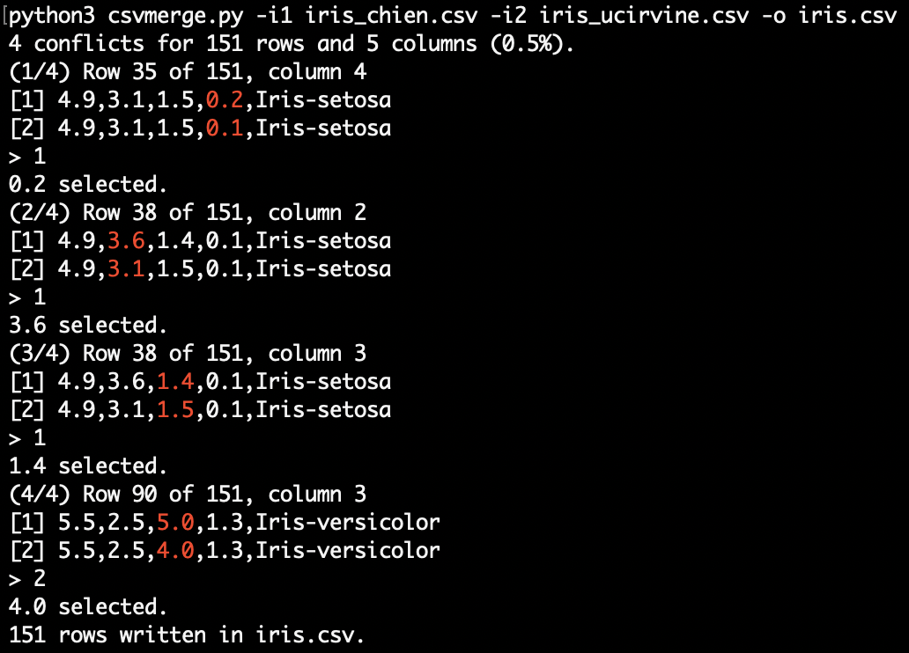

# csvmerge: an interactive merge tool for .csv files

[](https://www.python.org/)

This is an interactive merge tool specifically designed for .csv files and written in Python. It performs a line-by-line comparison and when it detects a conflict it prompts the user to select the source file from which to pick the preferred value.

## Basic usage

Run the script as:

```
python3 csvmerge.py -i1 <input-file-1> -i2 <input-file-2> -o <output-file>
```

In case of conflict the user is prompted to select the source file: they need to press `1` for file n. 1 or `2` for file n. 2, and confirm the choice with `<Enter>`.

If the user realizes that a specific conflict is going to recur consistently, they can automate their decision by entering `1+` or `2+`. This adds the choice to a list of automatic responses, preventing future prompts for that conflict. A series of asterisks on the screen indicates the total number of automatic choices that have been saved.

<p align="center">

<br/>
Iris data set from different sources<sup>1</sup>
</p>

## Other options

* Use `--sort` to sort alphabetically the columns of both input files. This option is useful when the two files share some, but not all, columns.
* Use `--skip1 <column-name>` and `--skip2 <column-name>` to remove the specified columns from file n. 1 and file n. 2 before the comparison begins. You can specify multiple columns for both files. Removed columns are added back to the output file, on the right, file n. 1 before file n. 2. This option, too, can be useful when the two files share only some columns.
* Use `--case-insensitive` to perform case-insensitive comparisons. If two values differ only by case, the value from file n. 1 will be selected.
* Use `--skip-empty` to ignore empty values. If only one of the conflicting cells is empty, the value of the other cell will be automatically selected.
* Use `--always <id>` if you already know what to do in case of conflict and you don't need to interact with the tool:
  * `--always 1` to always pick the value from file n. 1.
  * `--always 2` to always pick the value from file n. 2.
  * `--always l` to always pick the longest value. If the two values have the same length, the value from file n. 1 will be selected.
  * `--always s` to always pick the shortest value. If the two values have the same length, the value from file n. 1 will be selected.
* Use `-q` to activate quiet mode.
* Use `--no-color` to highlight the differences using asterisks rather than red ANSI formatting.
* Use `--info` to display the information about the input files and exit.
* Use `--delimiter <char>` to specify the character used to separate the values in the .csv files. It defaults to `,`.

All these options can be displayed by running the helper with `-h`.

`--sort`, `--skip1` and `--skip2` work only if the input files begin with a header row.

## Contributing

Contributions are most welcome by forking the repository and sending a pull request. Errors and new features proposals can be reported opening an issue as well.

## References

1. J. C. Bezdek, J. M. Keller, R. Krishnapuram, L. I. Kuncheva and N. R. Pal, ["Will the real iris data please stand up?"](https://lucykuncheva.co.uk/papers/jbjkrklknptfs99.pdf), in *IEEE Transactions on Fuzzy Systems*, vol. 7, no. 3, pp. 368-369, June 1999, doi: 10.1109/91.771092.
